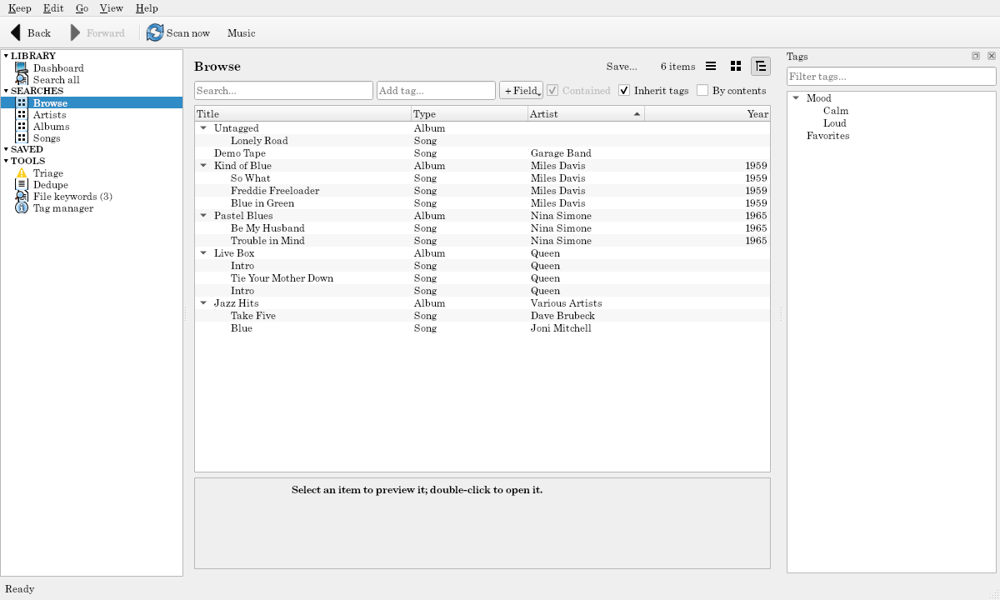
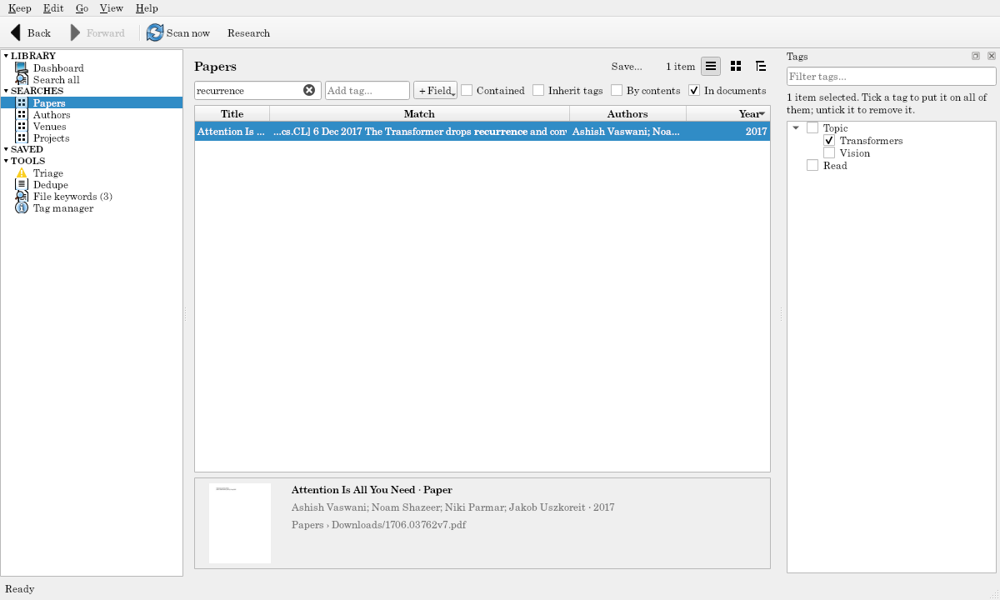

<p align="center">
  
</p>

<h1 align="center">Tagalot</h1>

<p align="center">
  Tag, search, and browse your music, movies, books, papers, and art,<br>
  without ever changing your files.
</p>

<p align="center">
  <a href="https://github.com/torstees/tagalot/actions/workflows/ci.yml"></a>
  <a href="https://github.com/torstees/tagalot/actions/workflows/package.yml"></a>
  <a href="https://github.com/torstees/tagalot/releases/latest"></a>
  <a href="https://torstees.github.io/tagalot/"></a>
  <a href="LICENSE"></a>
  <br>
  
  
  <a href="https://github.com/astral-sh/ruff"></a>
  <a href="https://mypy-lang.org/"></a>
  <a href="https://github.com/astral-sh/uv"></a>
</p>

---

Tagalot is a tag-based file browser. Point a **keep** at folders of music, movies, books, papers, 2D art, or anything else (network shares included); Tagalot reads them into **items** you can tag in a hierarchy, search, and browse. It never changes your files.



- **Keeps** watch your folders. A share that's offline is shown as offline, never forgotten.
- **Tags** form a tree; a search for `Genre` finds `Genre › Fantasy` too, and a tag on an album can count for its songs.
- **Search** by tags (include or exclude), text, fields, and what items contain; save the searches you use.
- **Grids, lists, and trees**, and a page for every item with its details, files, and what it holds.
- **Tidy up** with Triage (untagged items, unlinked and missing files) and Dedupe (identical files, similar items, merging).
- **Search inside documents** (papers and books), and **look details up online** (by DOI or ISBN) only if you allow it.
- **Undo** everything you do.



## Themes

A keep's **theme** decides what its files are. Built in:

| Theme | For | Makes |
|---|---|---|
| **Files** | any folder | one item per file |
| **2D assets** | art packs, game assets, fonts | artists holding images, fonts, and archives |
| **Music** | audio files with tags | artists ⊃ albums ⊃ songs; double-click plays |
| **Movies** | video files, Kodi/Plex style | collections ⊃ movies, with their cast from `.nfo` files |
| **Books** | EPUB, PDF, Markdown, Word, comics, web serials | books and comics, their authors, series, universes, collections |
| **Research** | papers, preprints, theses | papers with authors in order, venues, projects; Zotero exports, BibTeX, literature notes |

A theme is one Python file: [write your own](docs/THEMES.md) for recipes, photos, sheet music, or whatever you collect.

## Install

Download from [Releases](https://github.com/torstees/tagalot/releases/latest):

- **Windows:** run `Tagalot-…-Windows-setup.exe`. It installs for you alone (no administrator needed).
- **macOS:** open the `.dmg` and drag Tagalot to Applications.
- **Linux:** make the `.AppImage` executable (`chmod +x`) and run it.
- **Without installing:** the `.zip` (`.tar.gz` on Linux) holds the same program; unzip it and run `tagalot.exe`, `Tagalot.app`, or `tagalot` inside.

**The builds aren't signed yet,** so the first run asks: on Windows, "Windows protected your PC": choose **More info → Run anyway**; on macOS, go to **System Settings → Privacy & Security** and choose **Open Anyway**.

**From source,** with Python 3.12+ and [uv](https://docs.astral.sh/uv/):

```bash
git clone https://github.com/torstees/tagalot.git
cd tagalot
uv sync
uv run tagalot
```

## Quick start

1. Start Tagalot and choose **New keep…**: give it a name, a place, a theme, and the folder to watch.
2. It scans the folder (press **F5** to scan again any time).
3. Select items and tag them in the **Tags** panel: type a tag and press Enter (`Mood > Calm` makes both levels).
4. Search: type in the search box, or add a tag chip (Enter to include, Shift+Enter to exclude).

Or try a ready-made demo keep from a source checkout:

```bash
uv run python scripts/make_demo_keep.py --music --reset
uv run tagalot scratch/Music.keep
```

(`--assets`, `--movies`, `--books`, `--research` for the others; with [just](https://just.systems): `just demo-music`, `just demo-books`…)

## Documentation

- **[The documentation site](https://torstees.github.io/tagalot/):** getting started, a guide to every feature, the built-in themes, and reference.
- **[Writing a theme](docs/THEMES.md):** make Tagalot understand your kind of files.
- **[Design](docs/DESIGN.md):** how Tagalot works, and why.
- **[Privacy and your files](https://torstees.github.io/tagalot/#/reference/privacy):** Tagalot never changes your files (except Write to file…, where you allow it) and goes online only for lookups you allow.

## Contributing

Issues and ideas are welcome on [GitHub](https://github.com/torstees/tagalot/issues). To work on Tagalot, read [AGENTS.md](AGENTS.md) (the workflow, the rules, the commands), then:

```bash
uv sync
just check        # tests, lint, format, and types (or the uv run commands in AGENTS.md)
```

## License

[MIT](LICENSE) © 2026 Eric Torstenson
