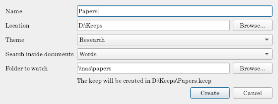

# Your first keep

## Make a keep

Start Tagalot. The **launcher** lists the keeps you've opened recently; choose **New keep…**.

- **Name:** what to call it (`Music`).
- **Location:** where the keep's folder goes. The keep becomes `<location>/<name>.keep`, shown under the form as you type. Put it on a local disk: a keep's databases don't work reliably on a network share (your *files* can be on one).
- **Theme:** what your files are. **Files** suits any folder; [the others](../themes/README.md) know music, movies, books, papers, and 2D art.
- **Search inside documents:** shown for themes with documents (Books, Research): **Words** (the default), **Substrings**, or **Off**. See [Searching inside documents](../guide/search-inside-documents.md).
- **Folder to watch:** the folder of your files. A network share works (`\\nas\music`, or a mapped drive) and is kept exactly as you type it. You can add more folders later.

**Create** makes the keep and opens it.

## Scan

Tagalot reads the folder: press **Scan now** (F5) on the toolbar whenever you want it to look again. A scan notices new, changed, moved, and missing files, and the status bar sums it up ("Scan finished: 120 new, 3 changed, 0 missing."). A folder that can't be reached (a share that's offline) is marked offline, and its items stay, waiting for it to come back.

After a scan, Tagalot makes the new items' thumbnails in the background ("Making thumbnails: N left").

## Look around

A keep opens on its [dashboard](../guide/dashboard.md): how many items of each kind, how many have no tags yet, your folders, what was added recently. The navigation on the left has:

- **Search all**, every item, grouped by kind;
- the theme's **searches** (Albums, Songs; Books, Authors…);
- your **saved** searches;
- **tools**: [Triage](../guide/triage.md), [Duplicates](../guide/dedupe.md), [File keywords](../guide/file-keywords.md), and the **Tag manager**.

## Tag something

1. Select an item (or many: Ctrl+click, Shift+click).
2. In the **Tags** panel on the right, type a new tag's name (`Favorites`) and press Enter: it's created and put on the selection. Tag paths work too: `Mood > Calm` makes both.
3. Tick or untick tags in the panel to add or remove them on everything selected.

Everything is undoable with **Edit → Undo** (Ctrl+Z). More in [Tags](../guide/tags.md).

## Search

Type in the search box above the results, or add a tag in the **Add tag…** box: Enter shows only items with it, Shift+Enter hides them. More in [Searching](../guide/searching.md).

## Next

- [Keeps and folders](../guide/keeps-and-folders.md): more folders, network shares, offline folders, skipping files.
- [The window](../guide/window.md): a tour of everything on screen.
