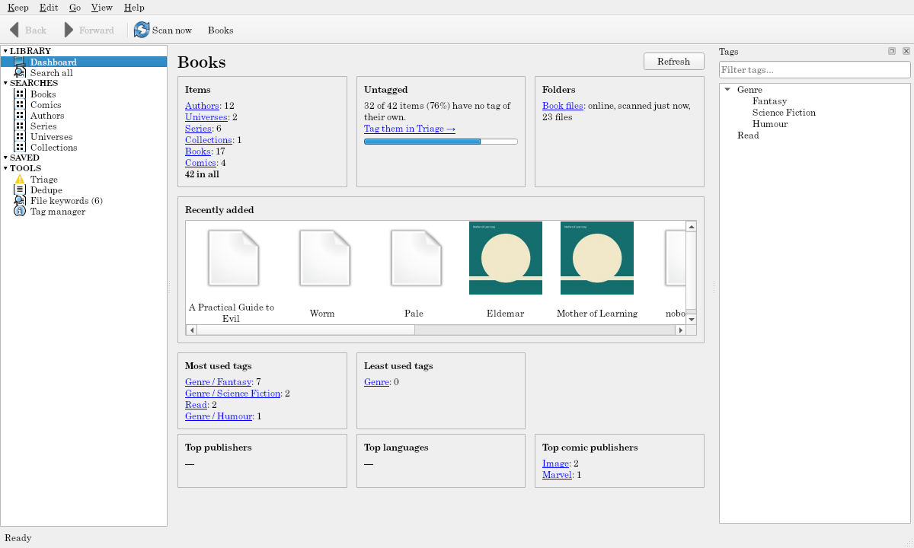

# The dashboard

A keep opens on its **dashboard** (LIBRARY → **Dashboard**), a page of cards. Every number is a link.

- **Items:** how many of each kind, and in all. A kind opens Search all narrowed to it.
- **Untagged:** how many items have no tag of their own, with **Tag them in Triage →**.
- **Folders:** each folder online (and when it was last scanned), offline, not watched, or not scanned yet, with its file count. A folder opens [Keep configuration](keep-configuration.md) on it.
- **Recently added:** the newest items' thumbnails; double-click one for its page.
- **Most used tags** and **Least used tags**, each opening a search.
- **The theme's cards:** music's total running time, average song, top genres, and top years; 2D assets' space used by images, image types, and biggest artists; books' top publishers, languages, and comic publishers; research's papers by year and top venues. A value opens a search of the items with it.

**Refresh** reads it again; it also refreshes after scans, tagging, and changes.
