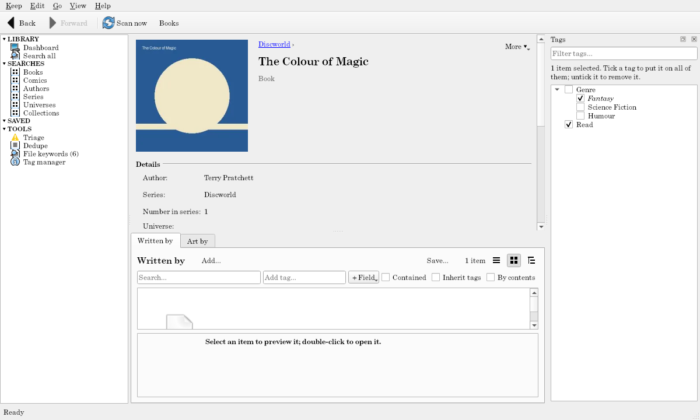

# Item pages

Double-click an item (or press Enter) for its page; for kinds that open their file on double-click (songs, plain files), Ctrl+Enter opens the page instead. **Back** returns to where you were.

## What's on a page

- **The header:** its thumbnail, title, and kind. Above the title, **breadcrumbs** show what holds it (`Discworld ›`), each opening that item's page.
- **Details:** its fields. Fields you can change show a ✎ when you point at them.
- **Extra fields:** fields of your own for this one item (a name and a value), searchable like any text.
- **Files:** each file it links, with its folder and size, and whether it's **offline** or **missing**. Right-click a file for Open file, Show in file manager, and Open with.
- **From the file:** the keywords its files gave and what became of each (see [File keywords](file-keywords.md)).
- **Related items:** a movie's cast, a book's writers, a paper's authors in order, what a paper cites: each a small search of its own, with **Add…** to add one by hand and **Remove from …** on its items' menus. What you add or remove by hand stays that way through later scans.
- **Contents:** for an item that holds others (an artist, an album, a series), a search of what it holds, with its own filter bar.
- **More ▾:** Open file, Show in file manager, Open with, Re-read from file, Look up online and Write to file… (when the keep offers them), and the theme's commands also appear as buttons.

Tagging on a page applies to the page's item, or to the items selected in its contents.

## Changing details

Double-click a value (or click its ✎) to edit it: **Enter** saves, **Esc** cancels. Numbers, dates (`2024-05-01`), and times are checked as you save, and a value that doesn't fit stays in the box with the reason. Yes/no fields are a checkbox. Some fields come from the file and can't be edited (a file's size, an image's width).

**A value you edited is yours:** it's marked "• edited", and scans never change it. Every edit is one step you can undo.

## Re-reading files

**Re-read from file** (right-click an item, or More ▾) reads its files again now, without a full scan: useful after editing a file's tags elsewhere. Values you edited stay. **Re-read from file, replacing my edits…** lets the files' values win (it asks first, and Edit → Undo puts your edits back).

## Opening files

- **Open file** opens an item's file with your computer's program for it (an album's folder opens as a folder).
- **Show in file manager** opens its folder with the file selected.
- **Open with ▸ Choose a program…** picks a program just this once; **Always open .ext files with…** makes it the program Tagalot uses for that kind of file (saved in your [settings](../reference/keep-files.md#settingstoml); **Stop using…** undoes that).

If the file can't be opened, the status bar says why: it's missing, its folder is offline, or the folder has no path on this computer.
