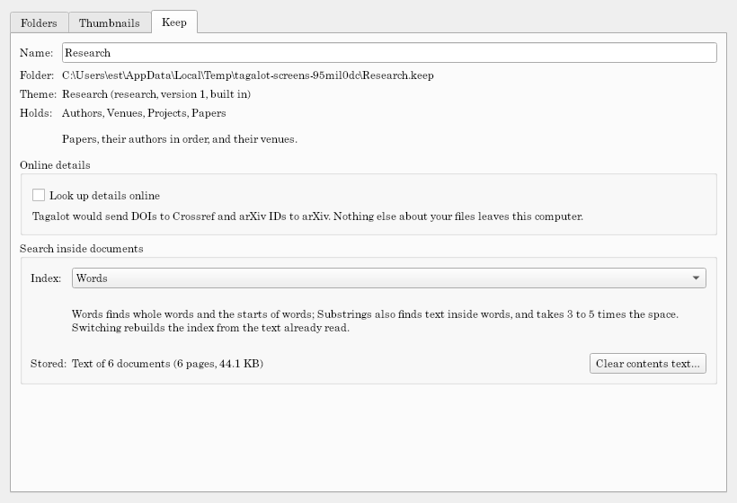

# Keep configuration

**Keep → Configure keep…** opens a window of three tabs. Every change is saved as you make it (to `keep.toml`, or to your own settings for **On this computer**); a value that can't be used is explained under the form.

## Folders

The folders the keep watches, each with its state (online, offline, not watched, not scanned yet). For the selected folder:

- **Name** and **Folder** (its path, exactly as you type it; a network share keeps its form).
- **On this computer:** a different path for this computer only (see [Keeps and folders](keeps-and-folders.md#on-this-computer)), with Browse and Clear.
- **Skip:** patterns for files to leave out, one per line, each with an optional note after ` # `. See [Skipping files](keeps-and-folders.md#skipping-files).
- **Write back:** "Let Write to file… change files in this folder", off unless you turn it on (it asks first). See [Writing to files](write-to-file.md).
- **Status:** how many files and folders it knows, how many are offline or missing, the last scan, and the last error.
- **Theme options for this folder:** the theme's settings for this folder only, over the keep's (tick one to override it here).
- **Scan now** (this folder), **Stop watching** / **Watch again**, and **Remove…**.

**Add folder…** watches another folder. Adding a folder, watching one again, or changing a path or Skip patterns offers to scan.

## Thumbnails

- **Largest size:** the theme's size, or one of the keep's own (16 to 2048 pixels). Bigger looks sharper when you zoom in, and takes more space. Thumbnails at the old size are made again as they're shown.
- **Make new and changed items' thumbnails after each scan:** on by default. Turn it off for a huge keep on a slow share; thumbnails are then made only as pages show them.
- **Stored:** how many thumbnails are stored and their size, with **Clear…** (also **Keep → Clear thumbnail cache…**). They're made again as you browse.

## Keep

- **Name** (editable), the keep's folder, its theme (and its version, and whether it's built in), and what kinds of items it holds.
- **Theme options:** the theme's settings for this keep, each with **Default**. They apply at the next scan, which reads the affected files again. The built-in ones: 2D assets' **Artist folder level** and books' **Source folder level** (see each [theme](../themes/README.md)).
- **Online details** (themes that look things up): **Look up details online**, and what it would send. See [Online details](online-details.md).
- **Search inside documents** (themes with documents): **Off**, **Words**, or **Substrings**, what's stored, and **Clear contents text…**. See [Searching inside documents](search-inside-documents.md).
