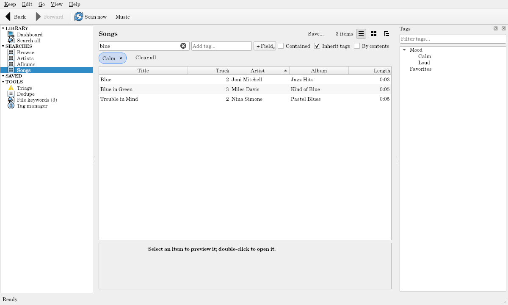

# Searching

Every page of results (Search all, the theme's searches, an item's contents) has the same **filter bar** above it.

## Text

Type in the **search box** (Ctrl+F jumps to it): items whose title, text fields (artist, album, description, abstract…), or your own extra fields contain every word match, ignoring case and accents (`bey` finds "Beyoncé"). It applies as you pause, or on Enter. With [**In documents**](search-inside-documents.md) ticked, items whose documents contain the words match too.

## Tags

Type in the **Add tag…** box; it suggests tags as you type (by name, alias, or description).

- **Enter** adds a blue chip: only items with that tag (or any of its sub-tags) are listed. Several chips must all match.
- **Shift+Enter** adds a red **not:** chip: items with that tag are left out.
- **×** on a chip removes it; **Clear all** removes every chip and the text.

From the Tags panel, right-click a tag for **Show only items with…** or **Hide items with…**.

## Fields

**+ Field** lists the fields every listed kind of item has. Pick one:

- a **choice** field (extension, genre, venue) lists its values among the results, with counts; tick the ones you want;
- a **range** field (year, size, width) has From and To;
- a **text** field has "contains" or "starts with".

**Apply** adds a purple chip (`Year: 1990–1999`, `Extension: .png, .jpg`); click the chip to change it.

## Toggles

At the right of the filter bar:

- **Contained:** also list what the matching items hold (an artist's albums and songs). Greyed out in the tree layout, which shows them as branches.
- **Inherit tags:** a tag on a container counts for what it holds. Tag a series `Fantasy`, and its books match `Fantasy`.
- **By contents:** a container matches when anything inside it matches (albums with a song tagged `Live`).
- **In documents:** the search box also looks inside documents' text (shown when the keep [searches inside documents](search-inside-documents.md)).

Each search remembers its toggles. The theme's searches start with sensible ones (its album and song searches inherit tags, for example).

## Within an item

Right-click an item that holds others (an artist, an album, a series) and choose **Show contents in search**: a grey **Within: …** chip limits the search to what it holds, keeping your other filters. A container's page has **Show in search** for the same thing.

## Search all

**Search all** lists every match grouped by kind, a section each (`▾ Albums (40)`), with the first few of each; **Show all** narrows to that kind with an **Only:** chip. When only one kind matches, its full list shows directly.

## Saved searches

**Edit → Save search…** (Ctrl+S) keeps the page as it is (its chips, text, toggles, layout, and sort) under **SAVED** in the navigation. On a saved search's page, Ctrl+S updates it; **Save search as…** (Ctrl+Shift+S) saves a copy under a new name. Right-click a saved search to rename or delete it. Saving, renaming, and deleting can be undone.

A "reading list" or "to watch" list is a saved search: say, Papers with the field filter `Read: Unread`.

## Sorting and columns

In the list layout, click a column's heading to sort by it (again to reverse). Right-click a heading to show or hide columns: the title always stays, **Tags** lists each item's own tags, and every field the listed items share can be a column. Each search remembers its columns.
