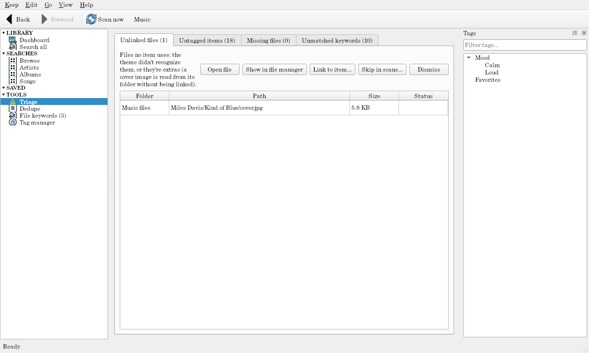

# Triage

TOOLS → **Triage** gathers what needs attention, in tabs with counts.

## Unlinked files

Files no item uses: a kind the theme doesn't recognize, extras (a movie's trailer), or a picture the theme read from its folder without linking. Select some, then:

- **Open file** or **Show in file manager** to see what they are.
- **Link to item…** links them to an item you pick, in a role that takes them (a cover, a supplement). A link you make by hand stays through scans, and the file's row on the item's page says "linked by you" (right-click it to unlink).
- **Skip in scans…** adds an exact pattern for each file to its folder's Skip list (with a note saying Triage did it); the next scan leaves them out.
- **Dismiss** hides them from this list until they change.

## Untagged items

Items with no tag of their own (or, with Inherit tags on, none from what holds them either). It's an ordinary search page: tag from the Tags panel, by drag and drop, or with Ctrl+T, and they leave the list. **Dismiss** hides items you mean to leave untagged, until they change.

## Missing files

Items whose files are all gone (missing, not just offline). **Show where they were** opens the folder the first file was in. **Delete…** deletes the items and their tags from the keep (after asking; it can be undone). Files on disk are never touched.

## Unmatched keywords

Items whose files give [keywords](file-keywords.md) that match no tag, with a **Keywords** column. A button opens the File keywords page to map or ignore them.

Dismissing and deleting are steps you can undo. The lists update after every scan, tagging, or change.
