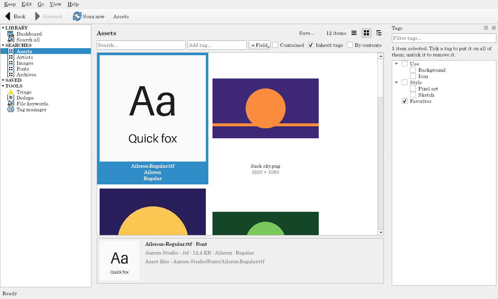

# The window

Each keep opens in a window of its own. Closing the window closes the keep (Keep → Close, Ctrl+W); open another with **Keep → Open another keep…** (Ctrl+O).

## Toolbar and menus

- **Back** and **Forward** (Alt+Left, Alt+Right, or the mouse's back and forward buttons) move through the pages you've seen, like a browser.
- **Scan now** (F5) scans every watched folder.
- **Keep:** Scan now, Clear thumbnail cache…, Configure keep…, Open another keep…, Close.
- **Edit:** Undo, Redo, Tag selection… (Ctrl+T), Save search… (Ctrl+S), Save search as… (Ctrl+Shift+S).
- **Go:** Back, Forward.
- **View:** the Tags panel, the Preview strip, the Activity panel (Ctrl+Shift+A), and Thumbnail size.
- **Help:** Keyboard shortcuts (F1).

## The navigation

On the left, in four groups (click a heading to fold it; a folded one shows how many it hides):

- **LIBRARY:** the [Dashboard](dashboard.md), and **Search all**, every item grouped by kind.
- **SEARCHES:** the theme's searches (Albums, Songs; Movies, Actors; Papers, Authors…).
- **SAVED:** your [saved searches](searching.md#saved-searches).
- **TOOLS:** [Triage](triage.md), [Dedupe](dedupe.md), [File keywords](file-keywords.md) (with how many match no tag), and the [Tag manager](tags.md#the-tag-manager).

## Results

A search shows its items in one of three **layouts**, chosen with the buttons at the top right (remembered for each search):

- **Grid:** thumbnails with a few lines under each (right-click for **Card lines** to choose which, and sizes). Make them bigger or smaller with **View → Thumbnail size**, Ctrl+wheel, or Ctrl+= and Ctrl+-.
- **List:** columns. Click a column's heading to sort by it; right-click a heading to show or hide columns (every field can be a column, and a **Tags** column lists each item's tags).
- **Tree:** containers with what they hold under them (an album and its songs).

The heading says how many items match. Select with a click, Ctrl+click, Shift+click, or Ctrl+A. **Double-click** (or Enter) opens the item's page, or plays or opens its file for kinds that open files (songs, plain files); **Ctrl+Enter** does the other.

Right-click an item for **Open page**, **Open file**, **Show in file manager**, **Open with**, **Show contents in search**, **Re-read from file**, and the theme's own commands (**Play album**, **Copy citation**…).

## The preview strip

Under the results, the **preview strip** shows the selected item: its thumbnail, title, kind, a few fields, and its file. Double-click it to open the page. **View → Preview** hides or shows it.

## The Tags panel

On the right: the tag tree, with a check for each tag showing whether the selected items have it (all, some, or none). See [Tags](tags.md). It's a panel you can move, float, or close (**View → Tags**).

## The status bar

Says what just happened ("Tagged 3 items with 'Favorites'.", "Scan finished: 12 new, 0 changed, 0 missing."), and shows background work: thumbnails being made, documents being read, online lookups. When files couldn't be read, a **⚠ N** badge at the right opens the [Activity panel](activity.md).

## Item pages

Double-click an item for its page: its picture and details, its files, its tags, and what it holds or relates to. See [Item pages](item-pages.md).
